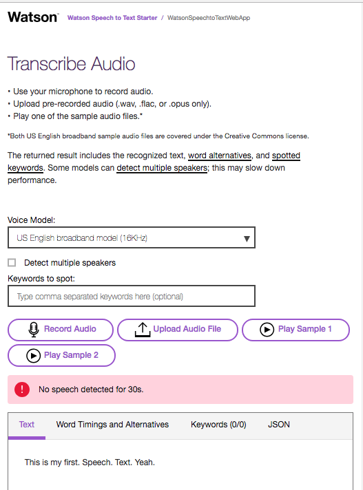

# Speech to Text starter kit [](https://bluemix.net)
# This was a quick start for me to learn this text-to-speech service from IBM Bluemix. 



## Getting started
1. Install the dependencies and start: 
    ```
    npm install
    npm start
    ```
2. Point your browser to [http://localhost:3000](http://localhost:3000).

## License
  This sample code is licensed under Apache 2.0.

## Open Source @ IBM
  Find more open source projects on the [IBM Github Page](http://ibm.github.io/)
